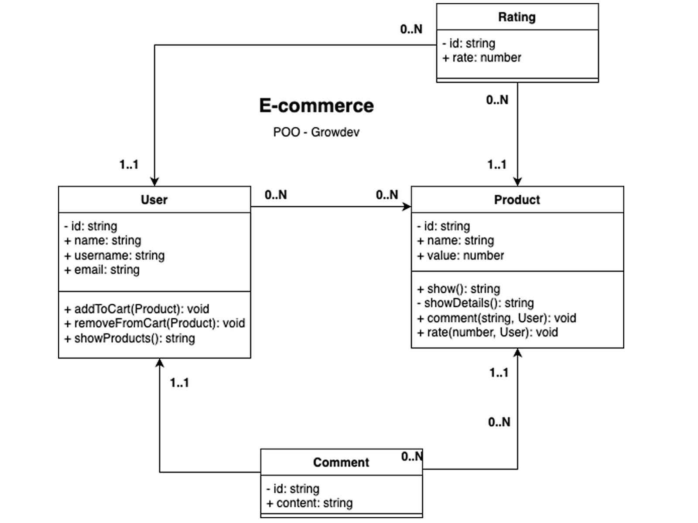

# E-comerce Growdev

Um sistema de e-comerce, que possui produtos e usuários, onde é possível o usuário inserir produtos em seu carrinho tal como avaliar os produtos através de comentários.

- Aplicar todos os pilares da POO.
- Classes devem estar separadas (arquivos).
- Banco de dados em memória (array).

- Requisitos:
    
    - `Req 1:` usuário adiciona produtos ao seu carrinho.

    - `Req 2:` usuário cria comentários.

    - `Req 3:` listar produtos do carrinho de um usuário.

    - `Req 4:` listar produtos junto com seus comentários.
        
